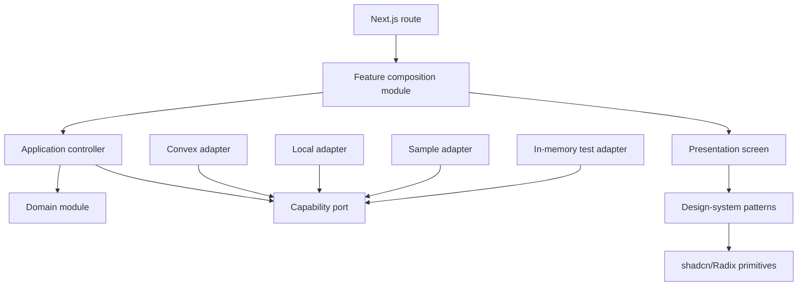

# Relay Design-System, Application, and Convex Seams

Status: Accepted for the MUI-to-shadcn migration  
Date: 2026-07-26

## Decision

Relay will use a capability-oriented architecture with three explicit seams:

1. The **design-system seam** exposes visual primitives and reusable visual patterns.
2. The **application seam** exposes screen models and semantic actions for one product capability.
3. The **data seam** exposes capability-specific ports implemented by local, sample, Convex, and in-memory test adapters.

Routes compose feature modules. Screens do not import Convex, Clerk, persistence code, generated function references, or domain mutation rules. Convex adapters do not return React elements, Tailwind classes, or shadcn types.

The current `useData()` interface and direct Convex hooks inside screen code are migration sources, not the target architecture.

## Context

Relay is a production workspace for projects, clients, deliverables, project files and versions, reviews, revisions, teams, settings, resources, salary batches, public profiles, and client portals.

The current implementation has several forms of coupling:

- the shared data context exposes React state setters instead of product actions;
- the main tracker owns presentation, application rules, route orchestration, and direct Convex hooks;
- public profile and client portal screens call Convex directly;
- local, sample, guest fallback, and cloud behavior are combined inside one provider;
- MUI styling helpers, application tokens, and route-specific styling overlap;
- some business rules live in the main screen module instead of a product capability.

The MUI-to-shadcn migration must not move this coupling into new Tailwind screen files.

## Dependency Classification

### In-process

These dependencies need no adapter:

- project validation and normalization;
- status, progress, due-date, payment, and permission rules;
- filtering, sorting, and grouping;
- display-label and semantic-tone derivation;
- settings normalization;
- project file and client portal projections;
- design tokens and visual variants.

These rules should be pure and tested directly through their module interface.

### Local-substitutable

These dependencies have local implementations:

- local workspace persistence;
- sample workspace data;
- in-memory test data.

They can implement the same capability ports as the cloud adapter.

### Remote but owned

Convex is remote but owned. Define ports at the data seam and implement Convex adapters for production. Preserve Convex reactive subscriptions, authentication, authorization, and transaction semantics inside those adapters.

The local, sample, Convex, and in-memory implementations make these real seams rather than hypothetical abstractions.

### True external

Clerk and object-storage providers are true external dependencies. Their details remain inside focused adapters. Application modules consume normalized session and file-transfer behavior rather than Clerk users, JWTs, S3 clients, or provider-specific errors.

## Constraints

Any accepted design must satisfy these invariants:

- shadcn and Tailwind modules never import Convex or Clerk;
- domain modules never import React, Next.js, shadcn, Tailwind, Convex, or Clerk;
- application modules never return React elements or CSS classes;
- screens never call generated Convex functions;
- screens never mutate shared arrays or settings through generic setters;
- capability ports expose product operations, not database CRUD;
- each Convex mutation keeps its existing transactional ownership;
- reactive Convex queries remain subscriptions rather than being converted into request/response fetching;
- public portal projections remain client-safe;
- local, sample, and cloud modes preserve their existing behavior;
- test adapters implement the same interface used by production callers.

## Designs Considered

### Design A: Single Workspace Facade

#### Interface

```ts
type Workspace = {
  state: WorkspaceState;
  execute(command: WorkspaceCommand): Promise<WorkspaceResult>;
};

function useWorkspace(): Workspace;
```

#### Caller

```ts
const workspace = useWorkspace();
workspace.execute({ type: "project.create", input });
```

#### Hidden implementation

The module would hide local storage, Convex subscriptions, mutations, permissions, migration fallback, settings, resources, teams, files, portals, and notifications.

#### Trade-offs

The interface is numerically small, but it is not deep. `WorkspaceState` and `WorkspaceCommand` become very large unions that every caller must understand. Unrelated changes collect in one module, rerender scope is broad, and locality is poor.

The deletion test also fails: deleting the facade mostly reveals pass-through dispatch logic rather than concentrated product behavior.

Decision: rejected.

### Design B: Generic Capability Registry

#### Interface

```ts
type CapabilityKey =
  "projects" | "settings" | "resources" | "team" | "files" | "clientPortal";

function useCapability<K extends CapabilityKey>(key: K): CapabilityMap[K];
```

#### Caller

```ts
const projects = useCapability("projects");
```

#### Hidden implementation

A central registry would select local, sample, or Convex implementations and return a capability-specific interface.

#### Trade-offs

This is flexible and makes adapter selection explicit, but the generic registry adds indirection without product leverage. Type mapping and registration become architecture that callers must understand. Capability ownership remains centralized, and the registry can become another shallow pass-through module.

Decision: rejected as the external interface. A composition root may internally assemble capability adapters, but callers will not use a generic registry.

### Design C: Screen-Specific Controllers

#### Interface

```ts
type ProjectsScreenController = {
  model: ProjectsScreenModel;
  actions: ProjectsScreenActions;
};

function useProjectsScreen(): ProjectsScreenController;
```

#### Caller

```tsx
const projects = useProjectsScreen();
return <ProjectsScreen {...projects} />;
```

#### Hidden implementation

The controller would hide filters, dialog state, permissions, display formatting, commands, and data access for one screen.

#### Trade-offs

The common caller is excellent: screens are simple, visual migrations are isolated, and behavior tests can cross one clear interface. However, putting all product behavior in screen-specific controllers couples application logic to the current information architecture. Shared project behavior can be duplicated across dashboard, projects, clients, calendar, media, and reports.

Decision: accepted only at the outer application seam, backed by reusable capability modules.

### Design D: Capability Ports and Adapters

#### Interface

```ts
type Loadable<T> =
  | { status: "loading" }
  | { status: "ready"; value: T }
  | { status: "error"; error: AppFailure };

interface ProjectsPort {
  projects: Loadable<readonly Project[]>;
  save(command: SaveProject): Promise<Result<ProjectId, ProjectFailure>>;
  remove(command: RemoveProject): Promise<Result<void, ProjectFailure>>;
  setStatus(command: SetProjectStatus): Promise<Result<void, ProjectFailure>>;
  setChecklistItem(
    command: SetChecklistItem
  ): Promise<Result<void, ProjectFailure>>;
  setPayment(command: SetProjectPayment): Promise<Result<void, ProjectFailure>>;
}
```

#### Caller

Application modules consume the port. Screens do not.

```ts
const projectsPort = useProjectsPort();
return createProjectsController(projectsPort, localViewState);
```

#### Hidden implementation

Adapters hide:

- Convex hooks and generated function references;
- local persistence;
- sample read-only behavior;
- optimistic updates and rollback;
- authentication and permissions;
- transport error normalization;
- cloud fallback behavior;
- transaction and subscription details.

#### Trade-offs

This design gives strong locality and testability. Ports use product operations rather than mutable setters. The risk is excessive port fragmentation or exposing every transport method. Ports must remain capability-oriented and use-case-grained.

Decision: accepted as the internal data seam.

## Recommended Hybrid

Use Design D internally and Design C externally.

Each feature has:

1. a pure domain module;
2. a capability port;
3. local, sample, Convex, and in-memory adapters;
4. an application controller that builds a display-ready model and semantic actions;
5. a presentation-only screen built from the design system.

This gives ordinary callers a small interface while concentrating persistence and product behavior behind deeper internal modules.

## Dependency Direction



Forbidden dependency directions:

- design system to features;
- design system to Convex or Clerk;
- domain to React or infrastructure;
- screens to adapters;
- screens to generated Convex modules;
- adapters to screens or design-system modules.

## Module Interfaces

### 1. Design-System Seam

The design system contains two layers.

#### Primitives

Owned shadcn/Radix source modules:

- Button;
- Input;
- Textarea;
- Label;
- Select;
- Switch;
- Dialog;
- AlertDialog;
- DropdownMenu;
- Popover;
- Tabs;
- Accordion;
- Progress;
- Badge;
- Avatar;
- Tooltip;
- Sheet;
- Skeleton;
- Separator.

Their interface consists of accessible behavior, semantic variants, sizing, and theme tokens. They do not know project statuses, team roles, or Convex documents.

#### Patterns

Reusable visual patterns:

```ts
type SemanticTone =
  "neutral" | "accent" | "success" | "warning" | "danger" | "info";

type StatusBadgeProps = {
  label: string;
  tone: SemanticTone;
};

type FieldProps = {
  label: string;
  description?: string;
  error?: string;
  required?: boolean;
  children: React.ReactNode;
};

type EmptyStateProps = {
  title: string;
  description: string;
  action?: React.ReactNode;
};
```

Application modules may depend on design-system interface types such as `SemanticTone`. The design system must not depend on application types.

### 2. Application Seam

Each route-facing feature exposes one controller interface.

```ts
type ProjectsWorkspace = {
  model: ProjectsScreenModel;
  actions: ProjectsScreenActions;
};

type ProjectsScreenModel = {
  state: "loading" | "ready" | "empty" | "error";
  query: string;
  filters: ProjectFiltersModel;
  personalProjects: readonly ProjectRowModel[];
  teamProjects: readonly ProjectRowModel[];
  selectedProject: ProjectDetailModel | null;
  permissions: ProjectPermissionModel;
  message?: string;
};

type ProjectsScreenActions = {
  setQuery(value: string): void;
  setFilters(value: ProjectFiltersInput): void;
  createProject(input: ProjectInput): Promise<ActionResult>;
  updateProject(id: ProjectId, input: ProjectInput): Promise<ActionResult>;
  deleteProject(id: ProjectId): Promise<ActionResult>;
  selectProject(id: ProjectId | null): void;
  updateStatus(id: ProjectId, status: ProjectStatus): Promise<ActionResult>;
};

function useProjectsWorkspace(): ProjectsWorkspace;
```

The controller interface includes:

- display-ready labels and semantic tones;
- normalized loading, empty, ready, and error states;
- permission-aware actions;
- local view state such as filters and selection;
- stable action outcomes suitable for toasts and inline errors.

It excludes:

- React elements;
- Tailwind classes;
- MUI or shadcn implementation types;
- Convex IDs where a product ID type exists;
- generated function references;
- raw transport errors;
- generic React state setters.

### 3. Data Seam

Ports are capability-specific and use product operations.

```ts
type Result<T, E> = { ok: true; value: T } | { ok: false; error: E };

type AppFailure =
  | { kind: "validation"; message: string; field?: string }
  | { kind: "unauthorized"; message: string }
  | { kind: "forbidden"; message: string }
  | { kind: "not-found"; message: string }
  | { kind: "conflict"; message: string }
  | { kind: "unavailable"; message: string; retryable: boolean }
  | { kind: "unexpected"; message: string; reference?: string };
```

Project operations must describe complete product use cases. Do not expose:

- `setItems`;
- `replaceAll` to screens;
- raw database insert, patch, or delete;
- a generic `execute(string, unknown)` dispatcher.

The same rule applies to settings, resources, salary batches, team workflows, project files, public profiles, and client portals.

## Adapter Rules

### Convex Adapter

The Convex adapter:

- owns all generated Convex imports;
- invokes React hooks unconditionally;
- maps subscriptions into `Loadable<T>`;
- maps application commands to use-case-grained mutations and actions;
- preserves transaction ownership;
- normalizes Convex and authentication errors into `AppFailure`;
- never leaks `ConvexError`, function references, or transport state to screens.

Do not add generic retries around Convex mutations or actions.

### Local Adapter

The local adapter:

- implements the same capability interface;
- owns local-storage serialization and migration;
- applies the same domain validation before persistence;
- returns promises for command parity even when persistence is synchronous;
- emits the same normalized failures.

### Sample Adapter

The sample adapter:

- exposes ready read models;
- returns a normalized read-only failure for mutating commands;
- does not emulate successful writes.

### In-Memory Adapter

The in-memory adapter:

- is deterministic;
- supports application tests without React, Convex, or local storage;
- records observable command outcomes;
- is not exposed through the production interface.

## Runtime Composition

Adapter selection happens at the application composition root.

Do not expose one frequently changing `WorkspacePorts` object through a single context because unrelated updates would rerender every capability.

Use capability-specific providers or selector-based contexts:

```tsx
<WorkspaceModeProvider mode={mode}>
  <ProjectsAdapterProvider>
    <SettingsAdapterProvider>
      <ResourcesAdapterProvider>{children}</ResourcesAdapterProvider>
    </SettingsAdapterProvider>
  </ProjectsAdapterProvider>
</WorkspaceModeProvider>
```

The exact provider nesting is implementation detail. Feature callers use `useProjectsPort()`, `useSettingsPort()`, and similar focused hooks.

The selected adapter must remain stable for the provider lifetime. Mode changes remount the capability provider rather than conditionally calling different hooks.

## Feature Shape

Target shape for one capability:

```text
features/
  projects/
    domain/
      model
      rules
    application/
      interface
      controller
      view-model
    data/
      port
      convex-adapter
      local-adapter
      sample-adapter
      in-memory-adapter
    ui/
      projects-screen
      project-detail
    index
```

This is a responsibility map, not a requirement to create every file immediately. Keep a module together until its implementation becomes hard to navigate, then split without changing its interface.

## Project Example

```tsx
export function ProjectsFeature() {
  const workspace = useProjectsWorkspace();

  return <ProjectsScreen model={workspace.model} actions={workspace.actions} />;
}
```

The screen may open dialogs and render controls, but it cannot build a persistence payload or decide whether a team member may mutate a project. Those decisions belong behind the application seam.

## Project-File and Client-Portal Example

Project files and client portals need separate capability ports because their failure modes and permissions differ from ordinary project editing.

```ts
interface ProjectFilesPort {
  files(projectId: ProjectId): Loadable<ProjectFilesSnapshot>;
  addExternalVersion(
    command: AddExternalVersion
  ): Promise<Result<ProjectFileId, ProjectFileFailure>>;
  prepareUpload(
    command: PrepareUpload
  ): Promise<Result<UploadTarget, ProjectFileFailure>>;
  finalizeUpload(
    command: FinalizeUpload
  ): Promise<Result<ProjectFileId, ProjectFileFailure>>;
  updateMetadata(
    command: UpdateProjectFile
  ): Promise<Result<void, ProjectFileFailure>>;
  remove(command: RemoveProjectFile): Promise<Result<void, ProjectFileFailure>>;
}
```

The adapter preserves the existing file/version model:

- a project file is the logical identity;
- project file versions are immutable history;
- approval and visibility rules remain server-owned;
- public portal projections never expose internal file metadata;
- upload preparation, transfer, and finalization remain distinct operations.

## Error and Ordering Semantics

- Loading is data state, not `undefined`.
- Expected failures are normalized values.
- Unexpected defects may still throw and reach the application error route.
- A successful command resolves only after its adapter has accepted the write.
- Optimistic updates and rollback are adapter implementation details.
- Controllers may translate `AppFailure` into user-facing messages but cannot discard the failure kind.
- Permissions are enforced in both the application model and the Convex mutation. UI disabling is not authorization.
- Commands that map to one Convex transaction remain one port operation.
- External side effects are not retried without explicit idempotency.

## Testing Strategy

The interface is the test surface.

### Domain

Test pure rules directly:

- project validation;
- permission decisions;
- progress and status derivation;
- salary-batch rules;
- file visibility;
- client-safe portal projection;
- settings normalization.

### Application

Test controllers with in-memory adapters:

- loading, ready, empty, and failure models;
- command success and failure;
- permission-aware action availability;
- filtering and selection;
- display labels and semantic tones.

### Adapters

Run shared contract tests against local and in-memory adapters. Verify Convex behavior through existing Convex tests and focused integration tests.

### Presentation

Render screens with fixed models and action fakes. Assert accessible behavior, not adapter calls, Tailwind classes, Radix internals, or generated markup.

When a deep module replaces shallow helpers, replace their implementation-level tests with tests at the new interface.

## Enforcement

Add repository checks during migration:

- generated Convex imports are allowed only in Convex adapters and composition modules;
- `components/ui` and visual patterns cannot import from features, Convex, Clerk, or application providers;
- domain modules cannot import React, Next.js, UI modules, Convex, or Clerk;
- screens cannot import Convex adapters;
- new code cannot expose `React.Dispatch` across the application seam;
- MUI and Emotion imports remain forbidden after migration.

These checks should begin as documented allowlists and tighten as each capability moves.

## Migration Sequence

1. Add dependency-direction checks without moving behavior.
2. Define shared result, failure, loadable, and semantic-tone interfaces.
3. Choose projects as the tracer capability because it exercises local, sample, Convex, permissions, filters, dialogs, and persistence.
4. Extract project rules from the tracker into a pure domain module.
5. Introduce a temporary adapter over the current data context.
6. Build the projects application controller and test it through an in-memory adapter.
7. Connect the existing precision projects screen through the controller interface.
8. Implement direct local, sample, and Convex project adapters.
9. Delete the temporary data-context adapter and generic project setters.
10. Repeat by capability: settings, resources, salary batches, team, project files, client portal, public profile.
11. Shrink the shared data context until it contains no product data, then delete it or retain only a small composition concern.
12. Complete the MUI provider and dependency removal after presentation modules have crossed the design-system seam.

The temporary adapter is a migration tool, not a permanent layer. Its deletion is part of the acceptance criteria.

## Related Presentation Architecture

The shared sizing, header, toolbar, section, responsive-grid, and scrolling
contracts for authenticated screens are defined in
[workspace-page-system.md](./workspace-page-system.md). That Module remains
inside the design-system seam described here and must not import application or
Convex concerns.

## Acceptance Criteria

The seam is established when:

- a screen can be rendered and tested without Convex, Clerk, local storage, or MUI;
- application controllers can be tested with an in-memory adapter;
- changing a shadcn primitive does not require editing application or Convex modules;
- changing a Convex function reference does not require editing screens;
- local, sample, and cloud implementations satisfy the same capability interface;
- product operations replace generic React setters;
- direct Convex hooks disappear from presentation modules;
- project rules have one implementation shared by every screen;
- dependency checks enforce the direction described here.

## Consequences

### Positive

- shadcn migration and backend evolution can proceed independently;
- business rules gain locality;
- screens become smaller and easier to redesign;
- local, sample, cloud, and test behavior use real adapters;
- Convex details remain concentrated;
- tests become faster and more behavioral;
- future contributors have clear ownership and dependency rules.

### Costs

- the migration introduces temporary duplication while adapters are replaced;
- capability interfaces require deliberate naming and error modeling;
- React provider composition must avoid broad rerenders;
- overly small ports would create shallow modules;
- screen-specific controllers must reuse capability rules rather than duplicate them.

These costs are controlled by migrating one capability at a time and deleting temporary layers before starting the next capability.
