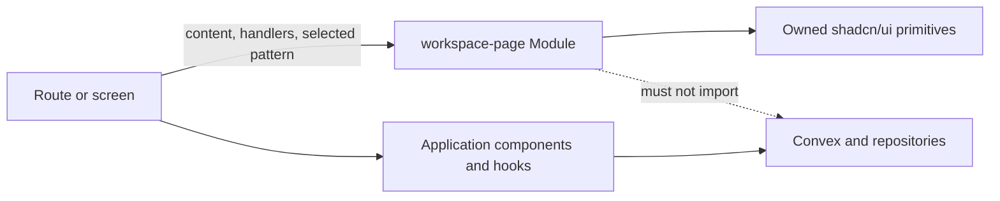

# Relay Workspace Page System

**Status:** Implemented architecture  
**Date:** 2026-07-29  
**Scope:** Authenticated workspace pages inside `WorkspaceShell`

## Decision

Relay will introduce an app-owned `workspace-page` Module at the design-system seam.

The Module owns:

- the content rail and horizontal gutters;
- page-header geometry and action placement;
- toolbar alignment and sticky behavior;
- metric-strip sizing;
- section framing;
- index, split-pane, master-detail, and fill-viewport layouts;
- the boundary between page scrolling and bounded panel scrolling;
- responsive collapse rules.

Route and screen files own:

- page-specific copy and actions;
- application state and event handlers;
- data mapping;
- feature components such as project rows, charts, calendars, and forms;
- which shared layout pattern is composed for the page.

The shared Module must not import Convex, Clerk, repositories, feature hooks, or application contexts. Its Interface is React composition plus a small set of semantic variants. Structural sizing is implemented with Tailwind tokens and CSS Grid, not JavaScript calculations.

This decision extends [design-system-application-convex-seams.md](./design-system-application-convex-seams.md). It does not change the existing application or data seams.

## Problem

The current pages repeat the same outer concerns with different values:

| Screen                      | Current maximum width | Current large layout                         |
| --------------------------- | --------------------: | -------------------------------------------- |
| Dashboard                   |                1540px | ledger + 320px inspector                     |
| Projects                    |                1580px | library + 320px inspector                    |
| Media                       |                1580px | 230px navigation + content + 300px inspector |
| Calendar                    |                1580px | calendar + 360px agenda                      |
| Timeline                    |                1400px | date rail + milestone list                   |
| Clients                     |                1500px | 320px master + detail                        |
| Feedback                    |                1400px | queue/list                                   |
| Reports                     |                1500px | 1.6fr chart + 0.8fr chart                    |
| Tracker `PageFrame` screens |                1580px | page-specific children                       |

This creates visible drift in title position, usable width, action placement, density, and empty space. The existing `PageFrame` is a shallow Module: it standardizes one wrapper and header but also reaches into tracker settings, page context, reduced motion, and notifications. Precision screens bypass it, so the Interface does not provide enough Leverage to control the workspace.

## Architectural seam



The seam is intentionally one-way:

1. Screens compose the public workspace-page Interface.
2. The workspace-page Implementation composes owned shadcn/ui primitives and semantic HTML.
3. Application state remains above the layout seam.
4. Convex data and mutations never enter the layout Module.

Deleting this Module would force every screen to reimplement width, gutters, headers, responsive grids, and scroll ownership. That gives the Module high Depth and Leverage while keeping its Interface small.

## Public Interface

The preferred Interface is compositional. Relay should not introduce a page-schema renderer or a large configuration object.

```tsx
<WorkspacePage family="master-detail">
  <PageHeader
    eyebrow="Relationships"
    title="Clients"
    description="Projects, delivery history, and account context."
    actions={<Button>New client</Button>}
  />

  <PageContent>
    <MetricStrip>
      <MetricItem label="Clients" value={clientCount} />
      <MetricItem label="Active projects" value={activeCount} />
      <MetricItem label="Delivered" value={deliveredCount} />
    </MetricStrip>

    <MasterDetail master={<ClientList />} detail={<ClientDetails />} />
  </PageContent>
</WorkspacePage>
```

The public exports should be:

```ts
export {
  WorkspacePage,
  PageHeader,
  PageContent,
  PageToolbar,
  MetricStrip,
  MetricItem,
  ContentSection,
  DataTableFrame,
  SplitPane,
  MasterDetail,
  FillViewport,
  PageEmptyState,
} from "@/components/workspace-page";
```

These components own structure. They do not own query state, selected records, mutations, permissions, or feature-specific formatting.

### `WorkspacePage`

Responsibilities:

- establish the single workspace content rail, fluid up to 1920px;
- apply standard gutters, top spacing, bottom spacing, and section rhythm;
- provide `min-w-0` and safe overflow defaults;
- optionally support a bounded full-height page body.

Interface:

```ts
type WorkspacePageProps = {
  children: React.ReactNode;
  family:
    | "data-index"
    | "master-detail"
    | "canvas"
    | "library"
    | "administration"
    | "conversation";
  mode?: "document" | "fill";
};
```

`document` is the default. `fill` is reserved for Calendar, Media, and Team Chat when their main work area must consume the remaining viewport height.

The component must not expose width or gutter props. Those are system invariants, not per-page choices.

### `PageContent`

`PageContent` owns the vertical rhythm between the header and a page family’s
content. Its `document` mode stacks sections with the shared section gap, while
its `fill` mode establishes the `min-height: 0` flex boundary required by
bounded canvas, media, project-index, and conversation workspaces.

### `PageHeader`

Responsibilities:

- align eyebrow, title, description, and actions;
- keep the same title origin on every page;
- stack actions below the title on narrow screens;
- reserve no space for controls that are not supplied.

Interface:

```ts
type PageHeaderProps = {
  eyebrow?: string;
  title: string;
  description?: string;
  actions?: React.ReactNode;
};
```

Notification controls stay in `WorkspaceShell`. `PageHeader` must not inject a notification bell or read application context.

### `PageToolbar`

Responsibilities:

- align search, filters, tabs, sorting, view controls, and secondary actions;
- let the primary search/control group grow while keeping actions intrinsic;
- wrap into predictable rows on small screens;
- optionally remain sticky inside the shell-owned scroll viewport.

Interface:

```ts
type PageToolbarProps = {
  primary: React.ReactNode;
  secondary?: React.ReactNode;
  sticky?: boolean;
};
```

The toolbar receives finished controls. It does not create or manage search and filter state.

### `MetricStrip`

Responsibilities:

- provide one compact metric band;
- divide items consistently;
- collapse through CSS Grid without runtime column calculations;
- preserve equal visual weight for values of different lengths.

Interface:

```ts
type MetricStripProps = {
  children: React.ReactNode;
  columns?: 2 | 3 | 4 | 5;
};

type MetricItemProps = {
  label: string;
  value: React.ReactNode;
  supporting?: React.ReactNode;
  icon?: React.ReactNode;
  action?: React.ReactNode;
};
```

`columns` selects a finite CSS variant. It must not generate `grid-template-columns` from the number of children at runtime.

### `ContentSection`

Responsibilities:

- own panel background, border, radius, clipping, and section header geometry;
- provide consistent title, description, metadata, and actions;
- support a padded body or an edge-to-edge body for tables and lists.

Interface:

```ts
type ContentSectionProps = {
  title?: string;
  description?: string;
  metadata?: React.ReactNode;
  actions?: React.ReactNode;
  bodyMode?: "padded" | "flush";
  children: React.ReactNode;
};
```

This replaces duplicated `surface` constants and page-local section wrappers.

### `DataTableFrame`

Responsibilities:

- provide a bounded table/list region with a stable header;
- own horizontal overflow;
- support an optional empty state and footer;
- keep TanStack Table details inside the feature table.

It does not define columns, sorting, selection, pagination, or row actions.

### `SplitPane`

Responsibilities:

- provide the common content + supporting-pane grid;
- stack panes below the desktop breakpoint;
- keep both columns `min-width: 0`;
- support a small set of semantic proportions.

Interface:

```ts
type SplitPaneProps = {
  primary: React.ReactNode;
  secondary: React.ReactNode;
  ratio?: "inspector" | "balanced" | "supporting";
  secondaryPosition?: "start" | "end";
};
```

CSS variants:

- `inspector`: `minmax(0, 1fr) 320px`
- `balanced`: `minmax(0, 1fr) minmax(320px, 0.72fr)`
- `supporting`: `minmax(0, 1.6fr) minmax(300px, 0.8fr)`

Arbitrary pixel widths and grid class strings are not part of the Interface.

### `MasterDetail`

Responsibilities:

- provide the collection + selected-record layout;
- use a 320px master column on desktop;
- stack into a single column below the large breakpoint;
- preserve independent bounded scrolling only when placed inside `FillViewport`.

Interface:

```ts
type MasterDetailProps = {
  master: React.ReactNode;
  detail: React.ReactNode;
  inspector?: React.ReactNode;
  variant?: "navigation" | "detail-rail";
};
```

With `inspector`, the large-screen grid becomes `320px minmax(0, 1fr) 320px`. Media can use this three-pane form. Mobile selected-detail behavior is supplied through an owned shadcn `Sheet` by the feature screen; it is not hidden inside `MasterDetail`.

### `FillViewport`

Responsibilities:

- consume the remaining height inside the shell-owned scroll viewport;
- provide `min-height: 0` to all grid descendants;
- expose header/body/footer rows for canvas and conversation pages;
- make only explicitly marked internal panels scroll.

Interface:

```ts
type FillViewportProps = {
  header?: React.ReactNode;
  body: React.ReactNode;
  footer?: React.ReactNode;
};
```

This is a CSS Grid with `auto minmax(0, 1fr) auto`. It must not read `window.innerHeight`, measure DOM nodes, or calculate pixel heights in TypeScript.

## Geometry contract

The following values are workspace invariants:

| Concern                | Contract                                                       |
| ---------------------- | -------------------------------------------------------------- |
| Content area           | Full available workspace width up to one shared 1920px maximum |
| Mobile gutter          | 16px                                                           |
| Tablet gutter          | 20px                                                           |
| Desktop gutter         | 24px                                                           |
| Page top spacing       | 16px mobile, 20px desktop                                      |
| Page bottom spacing    | 32px mobile, 48px desktop                                      |
| Major section gap      | 16px                                                           |
| Header bottom padding  | 16px                                                           |
| Header title           | 24px, compact line height                                      |
| Header description     | 13px, maximum readable width                                   |
| Toolbar minimum height | 44px                                                           |
| Section header         | 48px minimum                                                   |
| Panel radius           | 8px                                                            |
| Dense list row         | 52–60px                                                        |
| Inspector width        | 320px                                                          |
| Master-list width      | 320px                                                          |

The shared content rail replaces the current 1400px, 1500px, 1540px, and
1580px page roots. It remains fluid across ordinary desktop viewports and caps
only on ultra-wide displays, where a single 1920px limit prevents uncontrolled
line lengths and pane expansion.

Page files may control feature-level dimensions such as a thumbnail column or chart height. They may not override the content rail, page gutters, section rhythm, master width, or inspector width.

## Scroll contract

`WorkspaceShell` owns the primary workspace viewport and its vertical scroll. This is the most important invariant in the Module.

1. `WorkspacePage` must not use `min-h-dvh`, `h-dvh`, `position: fixed`, or another page-level `overflow-y-auto`.
2. Normal pages grow inside the shell-owned main element.
3. A local scroll region is allowed only when its bounding parent has a defined remaining height through `FillViewport`.
4. Tables own horizontal overflow; the entire page does not.
5. Master lists, inspectors, calendar agendas, and chat histories may scroll independently only in fill mode.
6. Switching tabs, filters, or activity views must not recreate the page root or reset the shell scroll position.
7. Sticky toolbars use the top edge of the shell viewport, not the browser window.

This prevents nested desktop scroll traps while preserving app-like bounded work areas where they are useful.

## Responsive contract

All responsive behavior is CSS-first:

| Range            | Behavior                                                                                                                              |
| ---------------- | ------------------------------------------------------------------------------------------------------------------------------------- |
| Below 640px      | Header actions stack full-width; toolbars become two rows; metrics use one column; secondary panes stack or open in a shadcn `Sheet`. |
| 640–1023px       | Metrics use two columns; search remains full-width; section actions may wrap; all detail layouts remain one column.                   |
| 1024–1279px      | Master-detail and balanced splits may activate when content remains readable.                                                         |
| 1280px and above | Inspector splits, three-pane Media, and dense page-family layouts activate.                                                           |

No component reads viewport width to choose markup. CSS Grid, responsive utilities, container-safe `minmax(0, 1fr)`, and shadcn `Sheet` handle adaptation.

## Shared component system

The Module should live here:

```text
src/components/workspace-page/
├── workspace-page.tsx
├── page-header.tsx
├── page-content.tsx
├── page-toolbar.tsx
├── metric-strip.tsx
├── content-section.tsx
├── data-table-frame.tsx
├── split-pane.tsx
├── master-detail.tsx
├── fill-viewport.tsx
├── page-empty-state.tsx
└── index.ts
```

Implementation rules:

- Compose existing owned shadcn/ui primitives.
- Use Radix behavior through shadcn for interactive primitives.
- Use Lucide for icons.
- Use Motion only for meaningful entry or state transitions; geometry does not depend on Motion.
- Keep Recharts inside report/chart feature components.
- Keep TanStack Table inside complex table feature components.
- Use token-backed colors and radii from `globals.css`.
- Use `cn` and finite variants for semantic layout choices.
- Do not accept arbitrary `maxWidth`, `padding`, or `gridTemplateColumns` values.
- Do not accept page-specific configuration objects that reproduce JSX indirectly.
- Do not import Convex, Clerk, tracker contexts, repository interfaces, or feature hooks.

This follows the shadcn ownership model: Relay owns and can refine the source, while the public Interface remains app-specific.

## Suggested page families

Every page uses the same outer chrome. Page families only select the internal composition.

### Data and index

Pages: Dashboard, Projects, Timeline, Reports.

Composition:

```text
WorkspacePage
├── PageHeader
├── PageToolbar (when needed)
├── MetricStrip
└── Page content
    ├── DataTableFrame or timeline sections
    └── SplitPane (when an inspector or supporting chart exists)
```

- Dashboard uses an inspector `SplitPane`, then a balanced lower section.
- Projects uses an inspector `SplitPane` around its table and selected project.
- Timeline uses grouped `ContentSection` lists without a persistent inspector.
- Reports uses a supporting `SplitPane` for the primary trend and work mix.

### Master-detail

Pages: Clients, Media, Feedback.

Composition:

```text
WorkspacePage
├── PageHeader
├── PageToolbar
├── MetricStrip (optional)
└── MasterDetail
```

- Clients uses master + detail.
- Media uses master + detail + inspector.
- Feedback uses master + detail when a review item is selected.

The selected item and mobile Sheet state remain application concerns.

### Canvas and schedule

Page: Calendar.

Composition:

```text
WorkspacePage mode="fill"
├── PageHeader
├── PageToolbar
└── FillViewport
    └── SplitPane ratio="inspector"
        ├── Calendar canvas
        └── Selected-day agenda
```

Calendar grid calculations required by calendar semantics may stay inside the calendar feature. Page sizing and pane geometry do not.

### Library

Pages: Resources, Templates, Integrations.

Composition:

```text
WorkspacePage
├── PageHeader
├── PageToolbar
├── MetricStrip (optional)
└── ContentSection
    └── library grid, list, or PageEmptyState
```

These are the simplest migration tracer pages because they exercise headers, actions, toolbars, metrics, sections, and empty states without specialized viewport behavior.

### Administration

Pages: Team, Settings, Account.

Composition:

```text
WorkspacePage
├── PageHeader
└── MasterDetail or SplitPane
    ├── section navigation / summary
    └── forms and administrative sections
```

Settings uses the 320px master column for its section index. Team uses a balanced split for membership and activity. Account uses document sections unless it needs an index.

### Conversation

Page: Team Chat.

Composition:

```text
WorkspacePage mode="fill"
├── PageHeader
└── FillViewport
    ├── conversation header
    ├── scrollable message history
    └── composer
```

Only the message history scrolls inside the fill region. The composer remains visible without fixed positioning or TypeScript height calculations.

## Ownership boundaries

| Concern                                                                     | Owner                       |
| --------------------------------------------------------------------------- | --------------------------- |
| Top bar, sidebar, primary viewport, notification bell                       | `WorkspaceShell`            |
| Page width, gutters, header, toolbar, layout grids, page/panel scroll rules | `workspace-page`            |
| Project rows, calendar cells, charts, client records, messages, forms       | Feature components          |
| Search/filter/selection state and event handlers                            | Application layer           |
| Data fetching, optimistic state, mutations, identity                        | Convex/application adapters |
| Dialog, Sheet, Tabs, Button, Input, Select behavior                         | Owned shadcn/ui components  |

The current tracker-local `PageFrame` should be deleted after its callers migrate. Its notification and settings dependencies must not move into the new Module.

## Rejected designs

### Keep extending tracker-local `PageFrame`

Rejected because it has low Depth. It owns only a wrapper and header while depending on application context and leaving all meaningful layout behavior to callers. Precision pages already bypass it.

### Render pages from a configuration schema

Rejected because a schema such as `{ header, metrics, toolbar, columns }` creates a second UI language, makes conditional content awkward, and expands the Interface whenever a new page needs an exception. JSX composition is clearer and more local.

### Expose arbitrary width and grid props

Rejected because this recreates the inconsistency at a different layer. Semantic variants provide enough flexibility without making every route a layout designer.

### One universal internal grid

Rejected because a calendar, a settings form, and a chat surface have genuinely different jobs. Uniform outer geometry and a small family of deep layout Modules provide consistency without flattening useful differences.

## Migration sequence

1. Add the `workspace-page` Module and an internal fixture that renders every primitive.
2. Migrate Resources as the simple library tracer.
3. Migrate Projects as the dense index + inspector tracer.
4. Confirm rail, header, toolbar, metric, section, and responsive behavior at shared viewport sizes.
5. Migrate Templates and Integrations.
6. Migrate Timeline, Reports, and Dashboard.
7. Migrate Clients, Feedback, and Media.
8. Migrate Team, Settings, and Account.
9. Migrate Calendar and Team Chat after fill-viewport behavior is verified.
10. Remove tracker-local `PageFrame`, duplicated `surface` constants, and page-root width/gutter classes.

Each slice should preserve existing feature state and Convex behavior. Layout migration must not be combined with application-data refactors.

## Acceptance criteria

- Every authenticated workspace page starts at the same horizontal origin at the same viewport width.
- Every normal workspace page uses the full available workspace width up to the shared 1920px maximum and standard gutters.
- Page files contain no root `max-w-[1400px]`, `max-w-[1500px]`, `max-w-[1540px]`, or `max-w-[1580px]` declarations.
- Page files do not calculate layout columns or remaining viewport height in TypeScript.
- Page actions occupy the same header region and stack consistently on mobile.
- Search, filters, sorting, and secondary actions use `PageToolbar`.
- KPI summaries use `MetricStrip` rather than page-local grids.
- Framed content uses `ContentSection` or a specialized shared frame.
- `WorkspaceShell` remains the only owner of primary vertical scrolling.
- Calendar, Media, and Team Chat use bounded fill layouts without nested page scroll traps.
- Tab and filter changes preserve the shell scroll position.
- Keyboard focus order follows visual order at every breakpoint.
- Existing light/dark tokens, project behavior, Convex subscriptions, and mutations remain unchanged.

## Verification strategy

The Interface is the test surface.

1. Add component tests for header ordering, optional regions, and semantic roles.
2. Add responsive browser checks at 390px, 768px, 1280px, and 1920px.
3. Compare bounding boxes for the page rail and title origin across representative routes.
4. Verify one primary vertical scroll owner per route.
5. Verify local scrolling for a long project table, client list, calendar agenda, and chat history.
6. Verify keyboard operation for toolbar controls and mobile detail Sheets.
7. Run existing typecheck, lint, and build checks after each migration slice.

Visual snapshots should cover one page from each family, not every route with identical chrome.
